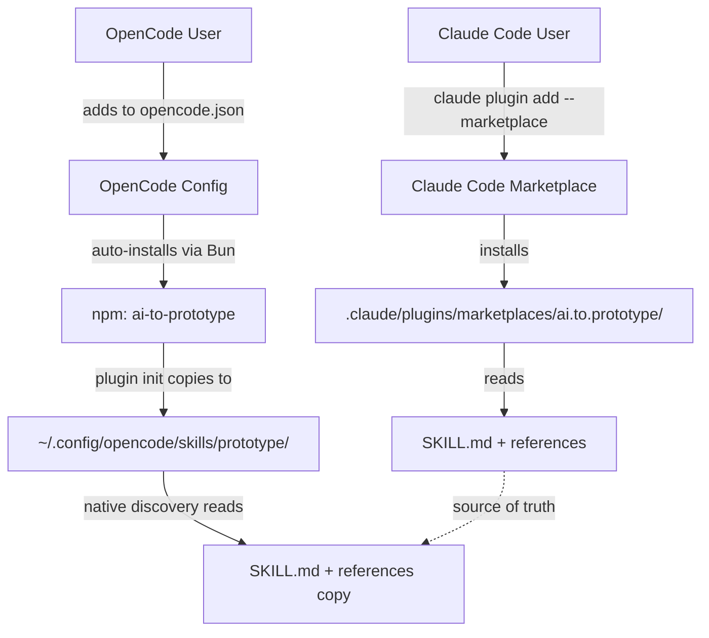
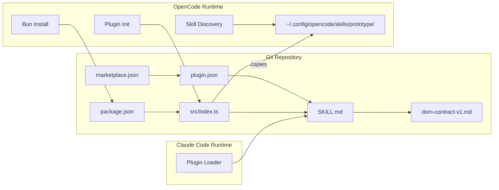
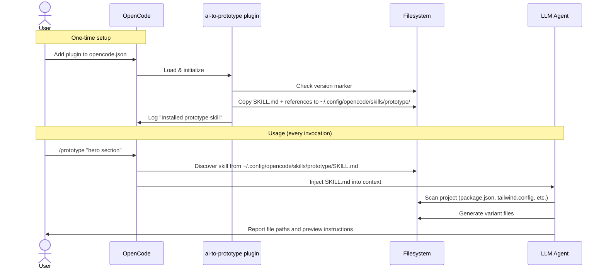

# Solution Design Document

## Validation Checklist

### CRITICAL GATES (Must Pass)

- [x] All required sections are complete
- [x] No [NEEDS CLARIFICATION] markers remain
- [x] Architecture pattern is clearly stated with rationale
- [x] **All architecture decisions confirmed by user**
- [x] Every interface has specification

### QUALITY CHECKS (Should Pass)

- [x] All context sources are listed with relevance ratings
- [x] Project commands are discovered from actual project files
- [x] Constraints → Strategy → Design → Implementation path is logical
- [x] Every component in diagram has directory mapping
- [x] Error handling covers all error types
- [x] Quality requirements are specific and measurable
- [x] Component names consistent across diagrams
- [x] A developer could implement from this design

---

## Constraints

CON-1: **Language**: OpenCode plugins must be TypeScript or JavaScript, using the `@opencode-ai/plugin` SDK. The plugin runs in Bun's runtime.
CON-2: **No Claude Code regression**: The `.claude-plugin/` directory structure and `marketplace.json` must remain unchanged. Claude Code must not be affected by npm packaging files.
CON-3: **Single SKILL.md source**: No duplication of the skill definition. The SKILL.md at `plugin/skills/prototype/SKILL.md` is the sole source of truth.
CON-4: **Cross-tool frontmatter**: Both tools ignore unknown YAML frontmatter fields. The SKILL.md must contain fields for both tools without breaking either.
CON-5: **Bun compatibility**: The npm package is installed and run via Bun, not Node.js. All code must be Bun-compatible.

## Implementation Context

### Required Context Sources

#### Code Context
```yaml
- file: plugin/skills/prototype/SKILL.md
  relevance: CRITICAL
  why: "The shared skill definition — must not be duplicated or diverged"

- file: plugin/skills/prototype/references/dom-contract-v1.md
  relevance: CRITICAL
  why: "DOM attribute schema referenced by SKILL.md — must be copied alongside it"

- file: plugin/.claude-plugin/plugin.json
  relevance: HIGH
  why: "Claude Code plugin metadata — must remain unchanged"

- file: .claude-plugin/marketplace.json
  relevance: HIGH
  why: "Claude marketplace registration — must remain unchanged"
```

#### External Documentation
```yaml
- url: https://opencode.ai/docs/plugins/
  relevance: CRITICAL
  why: "OpenCode plugin API — defines how plugins are loaded and what hooks are available"

- url: https://opencode.ai/docs/skills
  relevance: HIGH
  why: "OpenCode skill discovery — defines where skills are found and SKILL.md format"

- url: https://opencode.ai/docs/config/
  relevance: MEDIUM
  why: "OpenCode configuration — defines how users add plugins to opencode.json"
```

### Implementation Boundaries

- **Must Preserve**: All files under `.claude-plugin/` and `plugin/.claude-plugin/`. The SKILL.md body content. The DOM contract reference. The `.gitignore`.
- **Can Modify**: SKILL.md YAML frontmatter (add fields). `README.md` (add OpenCode instructions). Repository root (add `package.json`, `src/`, `tsconfig.json`).
- **Must Not Touch**: `plugin/skills/prototype/SKILL.md` body (below frontmatter). `plugin/skills/prototype/references/dom-contract-v1.md` content.

### External Interfaces

#### System Context Diagram



### Project Commands

```bash
# Core Commands
Install: npm install
Build:   npx tsc (compiles src/index.ts for npm distribution)
Lint:    npm run lint
Test:    npm test (manual verification in both tools)

# Publishing
Claude:  git push (marketplace pulls from GitHub)
OpenCode: npm publish (publishes to npm registry)
```

## Solution Strategy

- **Architecture Pattern**: Dual-distribution plugin with shared skill source. The repository serves two distribution channels from one codebase with zero skill duplication.
- **Integration Approach**: Claude Code reads skills from `plugin/skills/` via its marketplace plugin loader. OpenCode's npm plugin copies the same skill files to `~/.config/opencode/skills/prototype/` during initialization, enabling native discovery.
- **Justification**: This approach uses each tool's native discovery mechanism, ensuring `/prototype` works as a slash command in both tools. The plugin entry point is minimal (file copy only), reducing maintenance burden and failure surface.
- **Key Decisions**: Plugin copies to global config (not project-local) to avoid polluting user projects. Copy is idempotent and version-aware.

## Building Block View

### Components



### Directory Map

**Repository** (source of truth):
```
ai.to.prototype/
├── .claude-plugin/
│   └── marketplace.json            # UNCHANGED: Claude marketplace config
├── plugin/
│   ├── .claude-plugin/
│   │   └── plugin.json             # UNCHANGED: Claude plugin metadata
│   └── skills/
│       └── prototype/
│           ├── SKILL.md            # MODIFY: add OpenCode frontmatter fields
│           └── references/
│               └── dom-contract-v1.md  # UNCHANGED
├── src/
│   └── index.ts                    # NEW: OpenCode plugin entry point
├── package.json                    # NEW: npm package manifest
├── tsconfig.json                   # NEW: TypeScript config for src/
├── README.md                       # MODIFY: add OpenCode install instructions
└── .gitignore                      # MODIFY: add dist/ to ignores
```

**OpenCode runtime** (after plugin initialization):
```
~/.config/opencode/skills/
└── prototype/
    ├── SKILL.md                    # Copied from plugin/skills/prototype/
    └── references/
        └── dom-contract-v1.md      # Copied from plugin/skills/prototype/references/
```

### Interface Specifications

#### SKILL.md Frontmatter (Modified)

Current frontmatter:
```yaml
---
name: prototype
description: Generate multiple visually distinct UI component prototypes with an in-browser variant picker to flip through them. Scans your project's design dependencies to match your design language.
user-invocable: true
argument-hint: "[component description] [--variants N] [--style direction] [--framework name]"
metadata:
  contract-version: "1.0"
  author: ai.to.design
---
```

Updated frontmatter (additions only):
```yaml
---
name: prototype
description: Generate multiple visually distinct UI component prototypes with an in-browser variant picker to flip through them. Scans your project's design dependencies to match your design language.
user-invocable: true
argument-hint: "[component description] [--variants N] [--style direction] [--framework name]"
license: MIT
metadata:
  contract-version: "1.0"
  author: ai.to.design
---
```

Fields added for OpenCode:
- `license: MIT` — OpenCode optional field, ignored by Claude Code

Fields kept for Claude Code:
- `argument-hint` — Claude Code field, ignored by OpenCode

Fields shared:
- `name`, `description`, `user-invocable`, `metadata` — work in both tools

#### npm package.json

```json
{
  "name": "ai-to-prototype",
  "version": "1.0.0",
  "description": "Generate multiple visually distinct UI component prototypes with an in-browser variant picker. Works with OpenCode and Claude Code.",
  "author": "Roland Wallner",
  "license": "MIT",
  "type": "module",
  "main": "dist/index.js",
  "types": "dist/index.d.ts",
  "files": [
    "dist/",
    "plugin/skills/"
  ],
  "keywords": ["opencode", "opencode-plugin", "ui", "prototype", "design", "variants", "claude-code"],
  "peerDependencies": {
    "@opencode-ai/plugin": ">=1.0.0"
  },
  "devDependencies": {
    "@opencode-ai/plugin": "^1.4.0",
    "typescript": "^5.0.0"
  }
}
```

Key decisions:
- `files` includes `plugin/skills/` — ships the SKILL.md in the npm package
- `main` points to `dist/index.js` — compiled plugin entry point
- `@opencode-ai/plugin` is a peer dependency — OpenCode provides it at runtime

#### OpenCode Plugin Entry Point (`src/index.ts`)

```typescript
import type { Plugin } from "@opencode-ai/plugin"
import { cpSync, existsSync, readFileSync, mkdirSync } from "fs"
import { join, dirname } from "path"
import { fileURLToPath } from "url"

const __dirname = dirname(fileURLToPath(import.meta.url))
const SKILL_SOURCE = join(__dirname, "..", "plugin", "skills", "prototype")
const SKILL_TARGET = join(
  process.env.HOME ?? process.env.USERPROFILE ?? "",
  ".config",
  "opencode",
  "skills",
  "prototype"
)
const VERSION_FILE = ".ai-to-prototype-version"

export const AiToInterfaceDesign: Plugin = async ({ client }) => {
  syncSkillFiles(client)
  return {}
}

function syncSkillFiles(client: any): void {
  const pkg = JSON.parse(
    readFileSync(join(__dirname, "..", "package.json"), "utf-8")
  )
  const currentVersion = pkg.version
  const versionFile = join(SKILL_TARGET, VERSION_FILE)

  // Skip if already installed at this version
  if (existsSync(versionFile)) {
    const installedVersion = readFileSync(versionFile, "utf-8").trim()
    if (installedVersion === currentVersion) return
  }

  // Copy skill files to global OpenCode skills directory
  mkdirSync(SKILL_TARGET, { recursive: true })
  cpSync(SKILL_SOURCE, SKILL_TARGET, { recursive: true })

  // Write version marker for idempotency
  Bun.write(versionFile, currentVersion)

  client?.app?.log?.({
    body: {
      service: "ai-to-prototype",
      level: "info",
      message: `Installed prototype skill v${currentVersion} to ${SKILL_TARGET}`
    }
  })
}
```

**Design rationale:**
- Copies to `~/.config/opencode/skills/prototype/` — OpenCode's global skills directory
- Version-based idempotency — only re-copies when package version changes
- Uses a `.ai-to-prototype-version` marker file to track installed version
- Logs installation via OpenCode's plugin client API
- No project-level mutations — skill is installed globally

### Implementation Examples

#### Example: Plugin initialization flow

**Why this example**: Clarifies the version-checking and copy logic.

```
ALGORITHM: Plugin Skill Sync
INPUT: package version, skill source files
OUTPUT: skill files at ~/.config/opencode/skills/prototype/

1. READ package.json version
2. CHECK if ~/.config/opencode/skills/prototype/.ai-to-prototype-version exists
3. IF exists AND version matches → RETURN (no-op)
4. COPY plugin/skills/prototype/ → ~/.config/opencode/skills/prototype/ (recursive)
5. WRITE version to .ai-to-prototype-version
6. LOG "Installed prototype skill v{version}"
```

## Runtime View

### Primary Flow: OpenCode User Invokes `/prototype`

1. User adds `"ai-to-prototype"` to `opencode.json` `plugin` array
2. OpenCode starts, installs npm package via Bun to `~/.cache/opencode/node_modules/`
3. OpenCode loads plugin, calls `AiToInterfaceDesign` init function
4. Plugin copies SKILL.md + references to `~/.config/opencode/skills/prototype/`
5. OpenCode's native skill discovery finds `prototype` skill
6. User types `/prototype "hero section"` — OpenCode loads SKILL.md into agent context
7. Agent follows SKILL.md instructions: scans project, generates variants, outputs prototypes



### Error Handling

- **Missing HOME/USERPROFILE env var**: Plugin logs a warning and skips skill installation. The skill won't be discoverable via native discovery, but the npm package is still installed and users can manually copy.
- **Permission denied on `~/.config/opencode/skills/`**: Plugin catches the error, logs it, and skips. Users can manually copy or adjust permissions.
- **SKILL.md source missing from npm package**: This indicates a packaging error. Plugin logs an error. Fix: ensure `plugin/skills/` is in `package.json` `files` array.
- **Local skill name collision**: If user has a project-local `prototype` skill in `.opencode/skills/prototype/`, OpenCode's resolution order gives project-local precedence. The globally installed skill is shadowed — this is expected and correct behavior.

## Deployment View

### Publishing Workflow

Two independent publishing channels:

**Claude Code Marketplace** (unchanged):
- Push to GitHub `main` branch
- Claude marketplace pulls from `github:I2olanD/ai.to.prototype`
- No npm dependency — marketplace reads the repo directly

**OpenCode npm**:
- Run `npx tsc` to compile `src/index.ts` to `dist/index.js`
- Run `npm publish` to publish to npm registry
- OpenCode users auto-receive updates on next startup (Bun re-installs)

### Configuration

**OpenCode user config** (`opencode.json`):
```json
{
  "plugin": ["ai-to-prototype"]
}
```

No other configuration required. No API keys, no env vars.

### Rollback Strategy

- **npm**: `npm unpublish ai-to-prototype@<version>` (within 72h) or publish a fix version
- **Skill cleanup**: Users can delete `~/.config/opencode/skills/prototype/` to fully remove. The version marker file ensures a reinstall on next startup if the plugin is still configured.

## Cross-Cutting Concepts

### Pattern Documentation

```yaml
- pattern: "Idempotent file sync"
  relevance: CRITICAL
  why: "Plugin init runs on every OpenCode startup — must not re-copy unchanged files"

- pattern: "Dual-distribution from single source"
  relevance: HIGH
  why: "Same SKILL.md serves both Claude Code and OpenCode without duplication"
```

### System-Wide Patterns

- **Security**: No secrets, no API keys, no network calls. Plugin only copies local files. The SKILL.md is a plain markdown document with no executable code.
- **Error Handling**: All filesystem operations wrapped in try/catch. Failures are logged but never fatal — the plugin degrades gracefully.
- **Logging**: Uses OpenCode's `client.app.log()` API for installation messages.

## Architecture Decisions

- [x] **ADR-1: Copy to global skills directory**: Plugin initialization copies SKILL.md to `~/.config/opencode/skills/prototype/` for native discovery.
  - Rationale: Enables `/prototype` slash command support, agent auto-discovery via `skill` tool, and `user-invocable: true` behavior — all through OpenCode's native skill system.
  - Trade-offs: Mutates global filesystem. Mitigated by version-based idempotency and clean uninstall path.
  - User confirmed: **Yes**

- [x] **ADR-2: Keep SKILL.md in plugin/skills/**: Source of truth stays at `plugin/skills/prototype/SKILL.md`.
  - Rationale: Zero changes to Claude Code's marketplace plugin structure. The npm `files` field includes this path, so it ships in the npm package too.
  - Trade-offs: Path is nested under `plugin/`, which is Claude-specific naming. Acceptable because it's internal to the repo — users never see this path.
  - User confirmed: **Yes**

- [x] **ADR-3: Peer dependency on @opencode-ai/plugin**: Listed as peer dependency, not direct dependency.
  - Rationale: OpenCode provides this package at runtime. Avoids version conflicts and reduces package size.
  - Trade-offs: Package can't be used standalone outside OpenCode. This is intentional — it's an OpenCode plugin.
  - User confirmed: **Implicit** (follows OpenCode plugin conventions)

## Quality Requirements

- **Compatibility**: SKILL.md works identically in both Claude Code and OpenCode. No tool-specific behavior differences in the skill body.
- **Reliability**: Plugin initialization must not crash OpenCode. All errors are caught and logged, never thrown.
- **Performance**: File copy is < 50ms (two small markdown files). No impact on OpenCode startup time.
- **Maintainability**: Single SKILL.md source, minimal plugin code (~30 lines). Version-based sync means updates propagate automatically on npm publish.

## Acceptance Criteria

**PRD Feature 1: npm Package Distribution**
- [x] WHEN a user adds `"ai-to-prototype"` to `opencode.json` plugins, THE SYSTEM SHALL auto-install the package and copy the prototype skill to `~/.config/opencode/skills/prototype/`.
- [x] WHEN the user invokes `/prototype` in OpenCode, THE SYSTEM SHALL load the SKILL.md and generate prototypes following the same rules as Claude Code.

**PRD Feature 2: Cross-Compatible SKILL.md**
- [x] THE SYSTEM SHALL use a single SKILL.md with frontmatter fields for both tools.
- [x] WHEN Claude Code loads the SKILL.md, THE SYSTEM SHALL ignore OpenCode-specific fields (`license`).
- [x] WHEN OpenCode loads the SKILL.md, THE SYSTEM SHALL ignore Claude Code-specific fields (`argument-hint`).

**PRD Feature 3: Preserved Claude Marketplace**
- [x] THE SYSTEM SHALL NOT modify any files under `.claude-plugin/` or `plugin/.claude-plugin/`.
- [x] WHEN a Claude Code user installs via marketplace, THE SYSTEM SHALL work identically to the current behavior.

**Error Handling**
- [x] WHEN the plugin cannot write to `~/.config/opencode/skills/`, THE SYSTEM SHALL log a warning and continue without crashing.
- [x] WHEN a local prototype skill already exists in the user's project, THE SYSTEM SHALL NOT override it (OpenCode's resolution order handles precedence).

## Risks and Technical Debt

### Known Technical Issues

- OpenCode plugin API is not yet at v1.0 stability guarantee. The `client.app.log()` API may change.

### Implementation Gotchas

- **Bun vs Node.js**: The plugin runs in Bun, not Node.js. `fs` module works in Bun but `Bun.write()` is Bun-specific. Use `fs.writeFileSync` for portability if needed.
- **Windows paths**: `process.env.HOME` is undefined on Windows. Fall back to `process.env.USERPROFILE`. The `~/.config/opencode/` convention may differ on Windows — OpenCode may use `%APPDATA%/.opencode/` instead. Verify OpenCode's actual Windows skill paths.
- **Version marker file**: The `.ai-to-prototype-version` file in the skills directory is not a standard OpenCode convention. It won't interfere with skill discovery (OpenCode only reads `SKILL.md`), but it's a custom artifact.

## Glossary

### Domain Terms

| Term | Definition | Context |
|------|------------|---------|
| SKILL.md | Markdown file with YAML frontmatter that defines a reusable skill for AI coding assistants | Both Claude Code and OpenCode discover and load these files |
| Variant picker | In-browser toolbar that lets users flip between generated UI variants | Provided by `prototype.min.js`, unchanged by this work |
| DOM Contract | Attribute schema (`data-aitd-*`) that the variant picker uses to discover variants | Defined in `dom-contract-v1.md`, unchanged by this work |

### Technical Terms

| Term | Definition | Context |
|------|------------|---------|
| Claude Code marketplace | Distribution system for Claude Code plugins, backed by GitHub repos | Existing distribution channel, unchanged |
| OpenCode plugin | JS/TS module loaded by OpenCode at startup, installed via npm/Bun | New distribution channel being added |
| `@opencode-ai/plugin` | npm package providing TypeScript types and helpers for OpenCode plugins | Peer dependency for the plugin entry point |
| Bun | JavaScript/TypeScript runtime used by OpenCode for plugin installation and execution | OpenCode's runtime, not Node.js |
| Native skill discovery | OpenCode's built-in mechanism for finding SKILL.md files in standard directories | Target of the plugin's file copy — `~/.config/opencode/skills/` |
