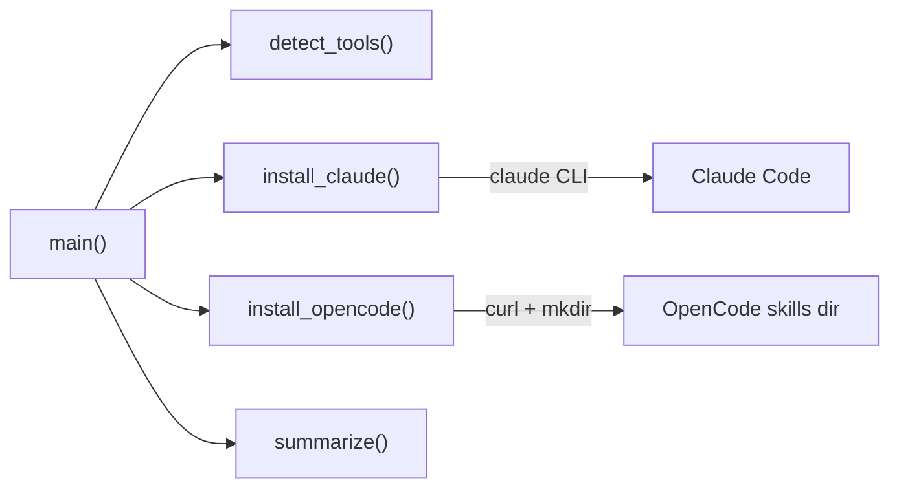
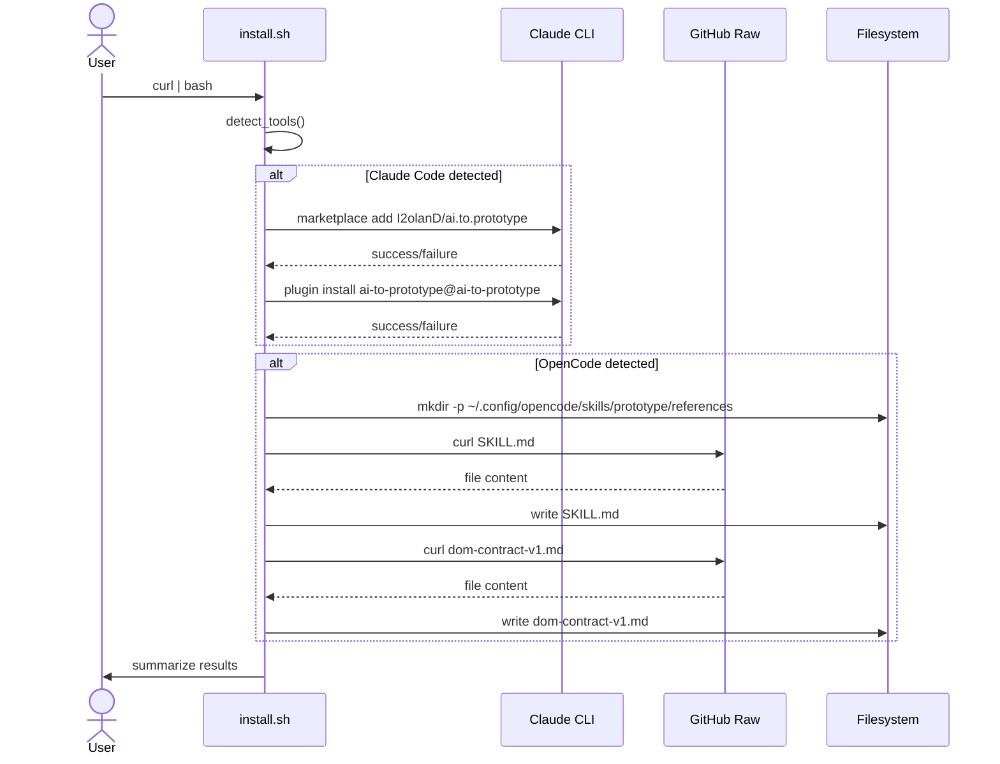

# Solution Design Document

## Validation Checklist

### CRITICAL GATES (Must Pass)

- [x] All required sections are complete
- [x] No [NEEDS CLARIFICATION] markers remain
- [x] Architecture pattern is clearly stated with rationale
- [x] **All architecture decisions confirmed by user**
- [x] Every interface has specification

### QUALITY CHECKS (Should Pass)

- [x] All context sources are listed with relevance ratings
- [x] Project commands are discovered from actual project files
- [x] Constraints → Strategy → Design → Implementation path is logical
- [x] Every component in diagram has directory mapping
- [x] Error handling covers all error types
- [x] Quality requirements are specific and measurable
- [x] Component names consistent across diagrams
- [x] A developer could implement from this design
- [x] Implementation examples use actual schema column names (not pseudocode), verified against migration files
- [x] Complex queries include traced walkthroughs with example data showing how the logic evaluates

---

## Output Schema

### SDD Status Report

| Field | Value |
|-------|-------|
| specId | 002-install-script-for-plugin-distribution |
| architecture | Single-file bash script with functions |
| keyComponents | detect_tools, install_claude, install_opencode, summarize |
| externalIntegrations | GitHub raw URLs, Claude CLI |
| sections | All COMPLETE |
| adrs | ADR-1 through ADR-4 CONFIRMED |
| validationPassed | All |
| validationPending | 0 |

---

## Constraints

- CON-1: **Bash + curl only** — No additional dependencies (no jq, python, git). The script runs in any standard Unix shell environment.
- CON-2: **Idempotent** — Safe to run multiple times. Claude CLI marketplace commands are idempotent by design. OpenCode file copy overwrites existing files.
- CON-3: **No interactivity** — The script must run unattended via `curl | bash`. No prompts, no menus, no user input.
- CON-4: **macOS + Linux** — Target platforms where bash, curl, and mkdir are available. No Windows/PowerShell support.

## Implementation Context

### Required Context Sources

#### Documentation Context
```yaml
- doc: README.md
  relevance: HIGH
  why: "Contains current manual install instructions that the script replaces"

- doc: plugin/skills/prototype/SKILL.md
  relevance: HIGH
  why: "File that must be downloaded for OpenCode installation"

- doc: plugin/skills/prototype/references/dom-contract-v1.md
  relevance: HIGH
  why: "Reference file that must accompany SKILL.md"
```

#### Code Context
```yaml
- file: plugin/.claude-plugin/plugin.json
  relevance: MEDIUM
  why: "Plugin metadata — confirms plugin name and version"

- file: .claude-plugin/marketplace.json
  relevance: MEDIUM
  why: "Marketplace config — confirms plugin ID and source path"

- file: package.json
  relevance: LOW
  why: "Project version (1.0.1)"
```

### Implementation Boundaries

- **Must Preserve**: All existing plugin files (SKILL.md, references/, plugin.json, marketplace.json). The install script is additive — it does not modify any existing project files.
- **Can Modify**: README.md (to add the curl | bash install command).
- **Must Not Touch**: .claude-plugin/marketplace.json, plugin/.claude-plugin/plugin.json, plugin/skills/.

### External Interfaces

#### System Context Diagram

```mermaid
graph TB
    User[Developer] -->|curl -fsSL url \| bash| Script[install.sh]

    Script -->|command: claude plugin marketplace add| ClaudeCLI[Claude CLI]
    Script -->|command: claude plugin install| ClaudeCLI
    Script -->|curl download| GitHubRaw[GitHub Raw Content]

    ClaudeCLI -->|git clone| GitHubRepo[GitHub Repository]
    ClaudeCLI -->|write| ClaudePlugins[~/.claude/plugins/]

    GitHubRaw -->|SKILL.md| Script
    GitHubRaw -->|dom-contract-v1.md| Script
    Script -->|write files| OpenCodeSkills[~/.config/opencode/skills/prototype/]
```

#### Interface Specifications

```yaml
# Outbound Interfaces (what the script calls)
outbound:
  - name: "Claude CLI"
    type: Shell command
    format: CLI arguments
    authentication: None (CLI handles its own auth)
    commands:
      - "claude plugin marketplace add I2olanD/ai.to.prototype"
      - "claude plugin install ai-to-prototype@ai-to-prototype"
    data_flow: "Script invokes CLI; CLI handles marketplace registration and plugin caching"
    criticality: HIGH

  - name: "GitHub Raw Content"
    type: HTTPS
    format: Plain text (Markdown files)
    authentication: None (public repository)
    urls:
      - "https://raw.githubusercontent.com/I2olanD/ai.to.prototype/main/plugin/skills/prototype/SKILL.md"
      - "https://raw.githubusercontent.com/I2olanD/ai.to.prototype/main/plugin/skills/prototype/references/dom-contract-v1.md"
    data_flow: "Script downloads skill files for OpenCode installation"
    criticality: HIGH

# Filesystem Interfaces (what the script writes to)
filesystem:
  - name: "OpenCode global skills directory"
    path: "~/.config/opencode/skills/prototype/"
    files:
      - "SKILL.md"
      - "references/dom-contract-v1.md"
    operation: "Create directory structure and write downloaded files"
```

### Project Commands

```bash
# Core Commands (discovered from package.json)
Install: npm install
Test:    npm test
Lint:    npm run lint
Typecheck: npm run typecheck
```

## Solution Strategy

- **Architecture Pattern**: Single-file procedural script with function-based decomposition. Each concern (detection, installation, reporting) is a named function.
- **Integration Approach**: The script is a new file at the repository root (`install.sh`). It does not modify any existing code. It integrates with Claude Code via its CLI and with OpenCode via direct file writes.
- **Justification**: A shell script is the simplest artifact that satisfies the `curl | bash` distribution requirement. Function decomposition keeps the ~100-line script readable and testable in isolation.
- **Key Decisions**: Use each tool's native installation mechanism (CLI for Claude Code, file copy for OpenCode) rather than a uniform approach, to maximize reliability and forward compatibility.

## Building Block View

### Components



| Function | Responsibility |
|----------|---------------|
| `main()` | Entry point. Calls detect, install, summarize. Manages exit code. |
| `detect_tools()` | Sets `HAS_CLAUDE` and `HAS_OPENCODE` flags based on environment checks. |
| `install_claude()` | Runs Claude CLI marketplace add + plugin install. Returns success/failure. |
| `install_opencode()` | Downloads files via curl, creates directory, writes files. Returns success/failure. |
| `summarize()` | Prints per-tool success/failure with colored output. |

### Directory Map

**Component**: install script (repo root)
```
.
├── install.sh        # NEW: The unified install script
```

**Target**: Claude Code (managed by Claude CLI — script does not write here directly)
```
~/.claude/
├── plugins/
│   ├── marketplaces/
│   │   └── ai-to-prototype/   # Created by `claude plugin marketplace add`
│   ├── cache/
│   │   └── ai-to-prototype/   # Created by `claude plugin install`
│   └── installed_plugins.json        # Updated by Claude CLI
```

**Target**: OpenCode (written directly by script)
```
~/.config/opencode/
└── skills/
    └── prototype/                     # NEW: Created by script
        ├── SKILL.md                   # Downloaded from GitHub raw
        └── references/
            └── dom-contract-v1.md     # Downloaded from GitHub raw
```

### Interface Specifications

No internal APIs, database schemas, or data models apply. The script's "interfaces" are the CLI commands and file writes documented in the External Interfaces section above.

## Runtime View

### Primary Flow

#### Primary Flow: Successful dual installation

1. User runs `curl -fsSL <url> | bash`
2. Script detects `claude` in PATH → sets `HAS_CLAUDE=1`
3. Script detects `~/.config/opencode/` exists → sets `HAS_OPENCODE=1`
4. Script runs `claude plugin marketplace add I2olanD/ai.to.prototype`
5. Script runs `claude plugin install ai-to-prototype@ai-to-prototype`
6. Script records Claude Code result (success or failure)
7. Script creates `~/.config/opencode/skills/prototype/references/` directory
8. Script downloads `SKILL.md` to `~/.config/opencode/skills/prototype/SKILL.md`
9. Script downloads `dom-contract-v1.md` to `~/.config/opencode/skills/prototype/references/dom-contract-v1.md`
10. Script records OpenCode result (success or failure)
11. Script prints summary and exits 0



### Error Handling

| Error Type | Detection | Behavior |
|------------|-----------|----------|
| No tools detected | Both `HAS_CLAUDE` and `HAS_OPENCODE` are 0 | Print error with manual instructions for both tools. Exit 1. |
| Claude CLI not authenticated | `claude plugin marketplace add` returns non-zero | Record failure. Print error message. Continue to OpenCode. |
| Claude CLI command fails | Any `claude plugin` command returns non-zero | Record failure. Print error with CLI output. Continue. |
| GitHub raw download fails | `curl` returns non-zero or empty file | Record failure. Print error. Continue to next tool. |
| Directory creation fails | `mkdir -p` returns non-zero | Record failure. Print error. Continue. |
| Partial success | One tool succeeds, one fails | Print mixed summary. Exit 0 (at least one succeeded). |
| All installations fail | Both tools detected but both fail | Print failure summary. Exit 1. |

## Deployment View

No change to existing deployment. The script is a static file served from GitHub's raw content CDN. No build step, no CI/CD pipeline change.

- **Environment**: User's local terminal (macOS, Linux)
- **Configuration**: None — the script is self-contained
- **Dependencies**: `bash`, `curl`, `mkdir` (standard Unix utilities). Optionally `claude` CLI for Claude Code installation.
- **Distribution URL**: `https://raw.githubusercontent.com/I2olanD/ai.to.prototype/main/install.sh`

## Cross-Cutting Concepts

### Pattern Documentation

```yaml
# No existing patterns apply — this is a standalone shell script
# No new patterns to document beyond the script itself
```

### System-Wide Patterns

- **Security**: The script downloads files over HTTPS from a known GitHub URL. No secrets are handled. No user credentials are stored. The `curl | bash` pattern inherits standard trust-the-source risks, mitigated by the README offering `git clone` + `./install.sh` as an alternative.
- **Error Handling**: Per-tool isolation. Each installation target runs independently. Failures are captured and reported but do not abort remaining work.
- **Logging**: Output to stdout/stderr only. No file-based logging. Colored markers (`✓`/`✗`) for visual scanning.
- **Idempotency**: Claude CLI commands are idempotent by design (re-adding a marketplace or re-installing a plugin is a no-op or update). OpenCode file copy overwrites existing files, which is the desired behavior for updates.

## Architecture Decisions

- [x] **ADR-1: Single-file bash script with functions**
  - Choice: One `install.sh` file using named bash functions
  - Rationale: Simplest distribution via `curl | bash`; no multi-file coordination needed
  - Trade-offs: All logic in one file (~100 lines); acceptable for this scope
  - User confirmed: **Yes**

- [x] **ADR-2: GitHub raw URLs for OpenCode file downloads**
  - Choice: `https://raw.githubusercontent.com/I2olanD/ai.to.prototype/main/plugin/skills/prototype/...`
  - Rationale: No git dependency; curl is already available; two small files
  - Trade-offs: Two HTTP requests; pinned to `main` branch (always latest)
  - User confirmed: **Yes**

- [x] **ADR-3: Colored terminal output with plain fallback**
  - Choice: ANSI color codes when stdout is a TTY; plain text otherwise
  - Rationale: Visual clarity in interactive use; safe when piped to logs
  - Trade-offs: Minor code for TTY detection (~5 lines)
  - User confirmed: **Yes**

- [x] **ADR-4: Per-tool error isolation with exit code semantics**
  - Choice: Exit 0 if at least one tool installation succeeds; exit 1 only if all fail or no tools detected
  - Rationale: Partial success is valuable — user gets the plugin in at least one tool
  - Trade-offs: A single-tool failure with overall exit 0 requires reading output to notice
  - User confirmed: **Yes**

## Quality Requirements

| Requirement | Target | How to Verify |
|-------------|--------|---------------|
| Execution time | < 30 seconds on broadband | Time the script end-to-end |
| Idempotency | Re-run produces same result | Run twice, verify no errors on second run |
| No leftover artifacts | Script creates only target files | Check no temp files remain after execution |
| Graceful degradation | Partial failure does not abort | Disconnect one tool, verify other still installs |
| Output clarity | User understands result in < 5 seconds | Manual review of output formatting |

## Acceptance Criteria

**Environment Detection:**
- [x] WHEN `claude` is in PATH, THE SYSTEM SHALL set `HAS_CLAUDE=1`
- [x] WHEN `~/.config/opencode/` exists, THE SYSTEM SHALL set `HAS_OPENCODE=1`
- [x] IF neither tool is detected, THEN THE SYSTEM SHALL print manual instructions and exit 1

**Claude Code Installation:**
- [x] WHEN `HAS_CLAUDE=1`, THE SYSTEM SHALL run `claude plugin marketplace add I2olanD/ai.to.prototype`
- [x] WHEN marketplace add succeeds, THE SYSTEM SHALL run `claude plugin install ai-to-prototype@ai-to-prototype`
- [x] IF any Claude CLI command fails, THEN THE SYSTEM SHALL record failure and continue

**OpenCode Installation:**
- [x] WHEN `HAS_OPENCODE=1`, THE SYSTEM SHALL create `~/.config/opencode/skills/prototype/references/` directory
- [x] WHEN directory exists, THE SYSTEM SHALL download and write `SKILL.md` and `references/dom-contract-v1.md`
- [x] IF download or write fails, THEN THE SYSTEM SHALL record failure and continue

**Result Summary:**
- [x] WHEN all installations complete, THE SYSTEM SHALL print per-tool status (success or failure)
- [x] IF at least one tool succeeded, THEN THE SYSTEM SHALL exit 0
- [x] IF all tools failed, THEN THE SYSTEM SHALL exit 1

**Idempotency:**
- [x] WHEN script is run a second time, THE SYSTEM SHALL produce the same end state without errors

## Risks and Technical Debt

### Known Technical Issues

None — this is a new script with no existing codebase.

### Technical Debt

None introduced. The script is self-contained with no dependencies to maintain.

### Implementation Gotchas

- **`curl | bash` and `set -e`**: When piped, bash may not handle `set -e` the same way as when run directly. The script should use explicit error checks (`if ! command; then`) rather than relying on `set -e` for per-tool error isolation.
- **Claude CLI output buffering**: The `claude plugin` commands may produce progress output that interleaves with the script's own messages. Consider redirecting Claude CLI stdout/stderr to capture and report cleanly.
- **macOS vs Linux `mkdir`**: Both support `mkdir -p`. No compatibility issue, but worth noting that no GNU-specific flags should be used.
- **Empty file detection**: After `curl` downloads a file, verify it's non-empty before considering the download successful. GitHub may return a 200 with an error page for moved/deleted files.

## Glossary

### Domain Terms

| Term | Definition | Context |
|------|------------|---------|
| Plugin | A package that extends an AI coding tool with new skills/commands | The ai.to.prototype plugin adds the `/prototype` skill |
| Skill | A specific capability provided by a plugin, invocable as a slash command | `/prototype` is the skill provided by this plugin |
| Marketplace | Claude Code's plugin distribution system, backed by Git repositories | Plugins are registered via `claude plugin marketplace add` |

### Technical Terms

| Term | Definition | Context |
|------|------------|---------|
| GitHub raw URL | Direct HTTPS URL to a file's raw content on GitHub | Used to download skill files without requiring git |
| Idempotent | An operation that produces the same result regardless of how many times it's run | The install script can be re-run safely |
| TTY | Terminal device; indicates interactive (not piped) shell usage | Used to decide whether to output ANSI color codes |
| ANSI color codes | Escape sequences that control terminal text color/formatting | Used for green checkmarks and red X marks in output |
