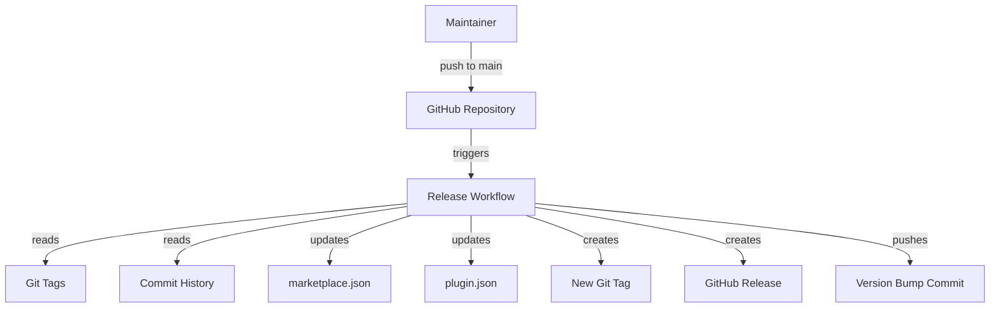
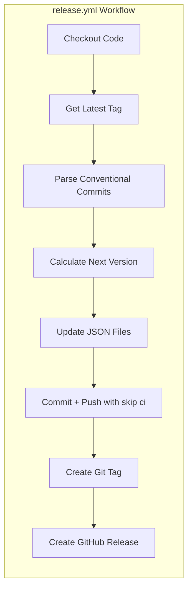
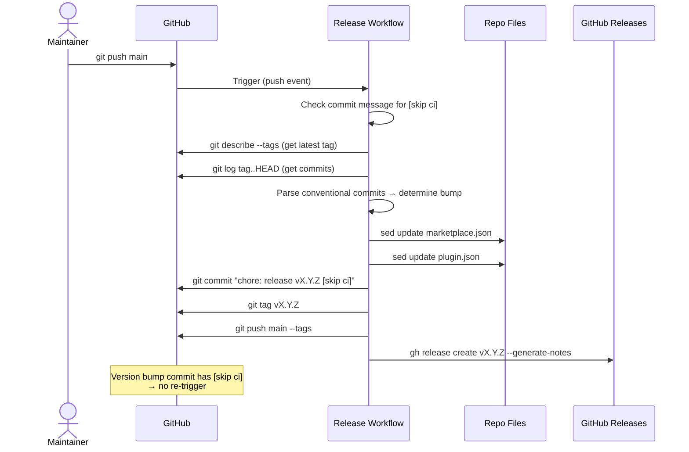

# Solution Design Document

## Validation Checklist

### CRITICAL GATES (Must Pass)

- [x] All required sections are complete
- [x] No [NEEDS CLARIFICATION] markers remain
- [x] Architecture pattern is clearly stated with rationale
- [x] **All architecture decisions confirmed by user**
- [x] Every interface has specification

### QUALITY CHECKS (Should Pass)

- [x] All context sources are listed with relevance ratings
- [x] Project commands are discovered from actual project files
- [x] Constraints -> Strategy -> Design -> Implementation path is logical
- [x] Every component in diagram has directory mapping
- [x] Error handling covers all error types
- [x] Quality requirements are specific and measurable
- [x] Component names consistent across diagrams
- [x] A developer could implement from this design

---

## Constraints

CON-1: **GitHub Actions only**: Workflow must use GitHub Actions (repo hosted on GitHub at `I2olanD/ai.to.interface-design`).
CON-2: **GITHUB_TOKEN**: No PATs. Use default `GITHUB_TOKEN` with minimal permissions.
CON-3: **No infinite loops**: Version bump commits must not re-trigger the workflow.
CON-4: **Two version files**: `.claude-plugin/marketplace.json` and `plugin/.claude-plugin/plugin.json` must both be updated atomically.
CON-5: **No external dependencies**: No Node.js, npm, semantic-release. Bash + `gh` CLI only.
CON-6: **Existing tag format**: Tags follow `v{major}.{minor}.{patch}` pattern (v1.0.0 through v1.0.6 exist).

## Implementation Context

### Required Context Sources

#### Code Context
```yaml
- file: .claude-plugin/marketplace.json
  relevance: CRITICAL
  why: "Contains version field that must be updated on each release"

- file: plugin/.claude-plugin/plugin.json
  relevance: CRITICAL
  why: "Contains version field that must be updated on each release"

- file: .github/workflows/release.yml
  relevance: CRITICAL
  why: "Does not exist yet — this is the file to create"
```

#### External Documentation
```yaml
- url: https://docs.github.com/en/actions/using-workflows/events-that-trigger-workflows
  relevance: HIGH
  why: "Push event filtering, skip ci behavior"

- url: https://docs.github.com/en/repositories/releasing-projects-on-github/automatically-generated-release-notes
  relevance: MEDIUM
  why: "gh release create --generate-notes behavior"
```

### Implementation Boundaries

- **Must Create**: `.github/workflows/release.yml`
- **Must Modify**: `.claude-plugin/marketplace.json` and `plugin/.claude-plugin/plugin.json` (by the workflow at runtime, not manually)
- **Must Not Touch**: Any other files. No package.json, no scripts, no additional config files.

### External Interfaces

#### System Context Diagram



### Project Commands

```bash
# No build commands — this is a pure GitHub Actions workflow
# Testing is done by pushing to main and observing workflow execution
```

## Solution Strategy

- **Architecture Pattern**: Single-file GitHub Actions workflow with bash-based version management. No external tools, no action marketplace dependencies beyond `actions/checkout`.
- **Integration Approach**: Workflow triggers on `push` to `main`, reads latest git tag, parses conventional commits, bumps version, updates JSON files, commits, tags, and creates a GitHub Release — all in one job.
- **Justification**: Minimal-dependency approach. The project has no Node.js toolchain, so semantic-release and similar tools would add unnecessary complexity. Bash + `gh` CLI (pre-installed on runners) handles everything needed.
- **Key Decisions**: Git tags are the version source of truth. JSON files are derived state. `[skip ci]` prevents loops. Conventional commits determine bump level.

## Building Block View

### Components



### Directory Map

```
ai.to.prototype/
├── .github/
│   └── workflows/
│       └── release.yml          # NEW: auto-release workflow
├── .claude-plugin/
│   └── marketplace.json         # MODIFIED AT RUNTIME: version field
└── plugin/
    └── .claude-plugin/
        └── plugin.json          # MODIFIED AT RUNTIME: version field
```

### Interface Specifications

#### Workflow Trigger

```yaml
on:
  push:
    branches: [main]
```

The workflow fires on every push to `main`. Version bump commits from the workflow itself use `[skip ci]` to prevent re-triggering.

#### Workflow Permissions

```yaml
permissions:
  contents: write
```

Minimal scope. `contents: write` covers:
- Pushing commits (version bump)
- Creating tags
- Creating releases

#### Version Calculation Algorithm

```
ALGORITHM: Determine Next Version
INPUT: latest git tag, commits since that tag
OUTPUT: next semver version string

1. GET latest tag via `git describe --tags --abbrev=0`
2. IF no tag exists → SET current = "0.0.0"
3. PARSE current into major, minor, patch
4. GET commit messages since tag via `git log {tag}..HEAD --oneline`
5. SCAN commit messages:
   a. IF any contain "BREAKING CHANGE" in body OR type ends with "!" → bump = major
   b. ELSE IF any start with "feat:" or "feat(" → bump = minor
   c. ELSE → bump = patch
6. APPLY bump:
   a. major: major+1, minor=0, patch=0
   b. minor: minor, minor+1, patch=0
   c. patch: major, minor, patch+1
7. RETURN "{major}.{minor}.{patch}"
```

#### JSON Update Pattern

Both files use the same pattern — `sed` replacement:

```bash
sed -i "s/\"version\": \"[^\"]*\"/\"version\": \"${NEW_VERSION}\"/" "$FILE"
```

This targets the `"version": "X.Y.Z"` field. Safe because:
- Both files are small (< 20 lines)
- Both have exactly one `"version"` field
- The pattern is unambiguous in these files

#### Commit and Tag Sequence

```
1. git add .claude-plugin/marketplace.json plugin/.claude-plugin/plugin.json
2. git commit -m "chore: release v{version} [skip ci]"
3. git tag "v{version}"
4. git push origin main --tags
5. gh release create "v{version}" --generate-notes
```

### Implementation: Complete Workflow

```yaml
name: Release

on:
  push:
    branches: [main]

permissions:
  contents: write

concurrency:
  group: release
  cancel-in-progress: false

jobs:
  release:
    runs-on: ubuntu-latest
    if: "!contains(github.event.head_commit.message, '[skip ci]')"
    steps:
      - name: Checkout
        uses: actions/checkout@v4
        with:
          fetch-depth: 0
          token: ${{ secrets.GITHUB_TOKEN }}

      - name: Configure git
        run: |
          git config user.name "github-actions[bot]"
          git config user.email "github-actions[bot]@users.noreply.github.com"

      - name: Determine next version
        id: version
        run: |
          LATEST_TAG=$(git describe --tags --abbrev=0 2>/dev/null || echo "v0.0.0")
          echo "latest_tag=${LATEST_TAG}" >> "$GITHUB_OUTPUT"

          CURRENT="${LATEST_TAG#v}"
          IFS='.' read -r MAJOR MINOR PATCH <<< "$CURRENT"

          COMMITS=$(git log "${LATEST_TAG}..HEAD" --pretty=format:"%s" 2>/dev/null || git log --pretty=format:"%s")

          BUMP="patch"
          if echo "$COMMITS" | grep -qiE "BREAKING CHANGE|^[a-z]+(\(.+\))?!:"; then
            BUMP="major"
          elif echo "$COMMITS" | grep -qE "^feat(\(.+\))?:"; then
            BUMP="minor"
          fi

          case "$BUMP" in
            major) MAJOR=$((MAJOR + 1)); MINOR=0; PATCH=0 ;;
            minor) MINOR=$((MINOR + 1)); PATCH=0 ;;
            patch) PATCH=$((PATCH + 1)) ;;
          esac

          NEW_VERSION="${MAJOR}.${MINOR}.${PATCH}"
          echo "version=${NEW_VERSION}" >> "$GITHUB_OUTPUT"
          echo "bump=${BUMP}" >> "$GITHUB_OUTPUT"
          echo "Next version: v${NEW_VERSION} (${BUMP} bump)"

      - name: Update version files
        run: |
          VERSION="${{ steps.version.outputs.version }}"
          sed -i "s/\"version\": \"[^\"]*\"/\"version\": \"${VERSION}\"/" .claude-plugin/marketplace.json
          sed -i "s/\"version\": \"[^\"]*\"/\"version\": \"${VERSION}\"/" plugin/.claude-plugin/plugin.json

      - name: Commit, tag, and push
        run: |
          VERSION="${{ steps.version.outputs.version }}"
          git add .claude-plugin/marketplace.json plugin/.claude-plugin/plugin.json
          git commit -m "chore: release v${VERSION} [skip ci]"
          git tag "v${VERSION}"
          git push origin main --tags

      - name: Create GitHub Release
        env:
          GH_TOKEN: ${{ secrets.GITHUB_TOKEN }}
        run: |
          VERSION="${{ steps.version.outputs.version }}"
          gh release create "v${VERSION}" \
            --title "v${VERSION}" \
            --generate-notes
```

## Runtime View

### Primary Flow: Push to Main Triggers Release



### Error Handling

| Error | Cause | Behavior |
|-------|-------|----------|
| No tags exist | First run on repo | Falls back to `v0.0.0`, bumps to `v0.1.0` or `v0.0.1` |
| Tag already exists | Concurrent runs | `git tag` fails, workflow fails. Concurrency group prevents this. |
| No commits since tag | Push was a no-op merge | `git log` returns empty. Default patch bump applies. |
| sed pattern not found | JSON structure changed | sed silently no-ops. Version files unchanged. Tag still created but files drift. Mitigated by files being stable. |
| Push rejected | Branch protection | Workflow fails. Requires PAT with bypass or adjusted rules. |

## Deployment View

### Setup

One-time: create `.github/workflows/release.yml` and push to main. The workflow is self-bootstrapping — the first run detects existing tags and bumps from `v1.0.6`.

### Configuration

No secrets or environment variables needed beyond the default `GITHUB_TOKEN`.

### Rollback Strategy

- **Bad release**: Delete the tag and release via `gh release delete vX.Y.Z --yes && git push --delete origin vX.Y.Z`. Then fix and push again.
- **Broken workflow**: Edit `release.yml` on main. The edit itself triggers the workflow — if the fix commit has real changes, a new release is created. If it's workflow-only, a patch bump occurs (acceptable).

## Cross-Cutting Concepts

### Pattern Documentation

```yaml
- pattern: "Tag-driven versioning"
  relevance: CRITICAL
  why: "Git tags are immutable source of truth. JSON files are derived state."

- pattern: "Skip-CI loop prevention"
  relevance: CRITICAL
  why: "Version bump commits contain [skip ci] to prevent infinite workflow triggers"

- pattern: "Concurrency serialization"
  relevance: HIGH
  why: "Concurrent pushes are serialized via concurrency group to prevent tag conflicts"
```

### System-Wide Patterns

- **Security**: Minimal permissions (`contents: write`). No PATs. Actions pinned by major version tag (v4). No third-party actions beyond `actions/checkout`.
- **Reliability**: Concurrency group prevents race conditions. `[skip ci]` prevents loops. Fallback to patch if commit parsing fails.
- **Observability**: Workflow run logs show version calculation, bump type, and release URL. GitHub Releases page shows full history.

## Architecture Decisions

- [x] **ADR-1: Git tags as version source of truth**: Version is derived from latest git tag, not from JSON files.
  - Rationale: Tags are immutable and atomic. Avoids "which file is canonical?" confusion.
  - Trade-offs: Local dev must run `git tag` to know current version. Acceptable for solo maintainer.
  - User confirmed: **Yes**

- [x] **ADR-2: [skip ci] for loop prevention**: Version bump commits include `[skip ci]` in commit message.
  - Rationale: GITHUB_TOKEN commits already don't trigger workflows by default, but `[skip ci]` is defense-in-depth. Simplest approach.
  - Trade-offs: If maintainer switches to PAT later, `[skip ci]` still protects.
  - User confirmed: **Yes**

- [x] **ADR-3: Conventional commit parsing**: `feat:` → minor, `fix:` → patch, `BREAKING CHANGE` → major, default → patch.
  - Rationale: Matches existing commit style. No external tooling. Bash `grep` parsing.
  - Trade-offs: Relies on commit discipline. Fallback to patch handles inconsistency.
  - User confirmed: **Yes**

- [x] **ADR-4: sed for JSON updates**: `sed -i` replaces `"version": "X.Y.Z"` in both files.
  - Rationale: No dependencies (jq not guaranteed). Both files have simple, unambiguous version fields.
  - Trade-offs: Fragile if JSON structure changes. Acceptable — files are stable and tiny.
  - User confirmed: **Yes**

- [x] **ADR-5: gh CLI for releases**: `gh release create` with `--generate-notes`.
  - Rationale: Pre-installed on GitHub runners. Auto-generates categorized release notes.
  - Trade-offs: Less customizable than REST API. Sufficient for this use case.
  - User confirmed: **Yes**

## Quality Requirements

- **Reliability**: 100% of non-[skip ci] pushes to main produce a release.
- **Speed**: Workflow completes in < 60 seconds.
- **Consistency**: Both JSON files always match the git tag version after release.
- **Simplicity**: Single workflow file, no external dependencies, no build steps.

## Acceptance Criteria

**PRD Feature 1: Auto Version Bump**
- [x] WHEN a push to main occurs with latest tag `v1.0.6`, THE SYSTEM SHALL bump to `v1.0.7` (or higher based on commits).
- [x] THE SYSTEM SHALL update `version` in both `.claude-plugin/marketplace.json` and `plugin/.claude-plugin/plugin.json`.
- [x] THE SYSTEM SHALL NOT re-trigger on its own version bump commit.

**PRD Feature 2: Git Tag**
- [x] THE SYSTEM SHALL create tag `v{version}` on the version bump commit.
- [x] THE SYSTEM SHALL use concurrency groups to prevent duplicate tags.

**PRD Feature 3: GitHub Release**
- [x] THE SYSTEM SHALL create a GitHub Release titled `v{version}` with auto-generated notes.
- [x] THE SYSTEM SHALL NOT mark releases as pre-release or draft.

**PRD Feature 4: Conventional Commit Bump**
- [x] THE SYSTEM SHALL parse commits since last tag for `feat:`, `fix:`, and `BREAKING CHANGE`.
- [x] THE SYSTEM SHALL default to patch bump if no conventional prefixes found.

## Risks and Technical Debt

### Known Technical Issues

- `actions/checkout@v4` pinned by major version tag, not SHA. Acceptable risk for a first-party GitHub action.
- `sed -i` behaves differently on macOS vs Linux. Workflow runs on `ubuntu-latest` so GNU sed is guaranteed.

### Implementation Gotchas

- **fetch-depth: 0**: Required for `git describe --tags` and `git log` to see full history. Default shallow clone would break version detection.
- **Concurrency cancel-in-progress: false**: Must NOT cancel in-progress runs — that could leave a partial release (commit pushed but no tag/release). Instead, queue and run sequentially.
- **GITHUB_TOKEN push**: Events triggered by GITHUB_TOKEN don't trigger subsequent workflow runs. This is a GitHub platform guarantee, making `[skip ci]` redundant but harmless as defense-in-depth.

## Glossary

### Technical Terms

| Term | Definition | Context |
|------|------------|---------|
| Conventional Commits | Commit message format using type prefixes (`feat:`, `fix:`, etc.) | Used to determine version bump level |
| `[skip ci]` | Commit message tag that tells CI systems to skip running workflows | Prevents infinite loop on version bump commits |
| Concurrency group | GitHub Actions feature that serializes or cancels concurrent workflow runs | Prevents parallel releases from conflicting |
| `gh` CLI | GitHub's official command-line tool, pre-installed on GitHub-hosted runners | Used for `gh release create` |
